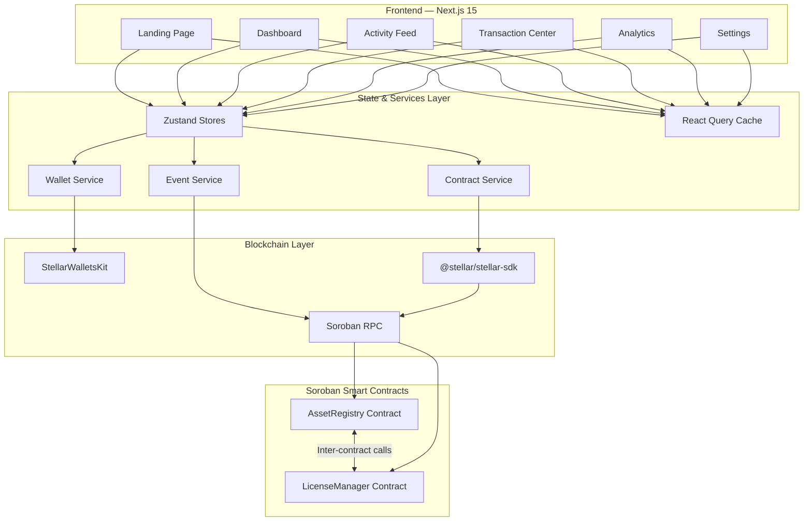
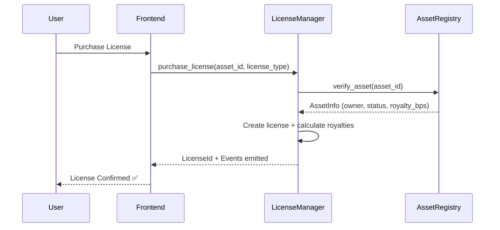

<
  
  
  

</div>

---

## 🎯 Problem Statement

Creators lose billions annually to unlicensed use of digital assets. Existing licensing is opaque, manual, and filled with intermediaries. There's no trustworthy way to prove ownership, enforce license terms, or automate royalty payments.

**Lumina** solves this by putting asset ownership and licensing logic **on-chain** via Soroban smart contracts on the Stellar network:

- **Immutable Proof**: Asset ownership registered on a public, decentralized ledger
- **Programmable Licenses**: Smart contracts enforce license terms automatically
- **Instant Royalties**: Creators receive payments the moment a license is purchased
- **Global Access**: Stellar's fast, low-cost network makes licensing accessible worldwide

---

## 🏗️ Architecture



### Inter-Contract Communication



---

## 📋 Smart Contract Design

### Contract 1: AssetRegistry

| Function | Description | Auth |
|----------|-------------|------|
| `initialize` | Set admin and LicenseManager address | Admin |
| `register_asset` | Register a new digital asset | Owner |
| `transfer_asset` | Transfer asset ownership | Current owner |
| `verify_asset` | Verify asset and return info (used by LicenseManager) | Public |
| `get_asset` | Get full asset details | Public |
| `get_owner_assets` | List all assets for an owner | Public |
| `update_asset_status` | Activate/deactivate asset | Owner or Admin |
| `upgrade` | Upgrade contract WASM | Admin |

**Storage**: Instance (admin, config) • Persistent (assets, owner lists)

### Contract 2: LicenseManager

| Function | Description | Auth |
|----------|-------------|------|
| `initialize` | Set admin, AssetRegistry address, platform fee | Admin |
| `create_license_template` | Create license offering (calls AssetRegistry) | Asset owner |
| `purchase_license` | Purchase a license (calls AssetRegistry) | Buyer |
| `verify_license` | Check if license is valid | Public |
| `revoke_license` | Revoke a license | Owner or Admin |
| `get_license` / `get_user_licenses` / `get_asset_licenses` | Query licenses | Public |
| `upgrade` | Upgrade contract WASM | Admin |

**Inter-contract calls**: `purchase_license` and `create_license_template` both call `AssetRegistry::verify_asset()` to validate asset existence and ownership.

---

## ✨ Features

| Feature | Description |
|---------|-------------|
| 🔐 **Blockchain Verification** | Immutable proof of ownership on Stellar |
| 📜 **Smart Licenses** | 5 license types: Personal, Commercial, Editorial, Enterprise, Exclusive |
| 💰 **Auto Royalties** | Automatic royalty calculation and distribution |
| 🧠 **AI Detection** | Copyright detection abstraction layer (extensible) |
| 📊 **Analytics Dashboard** | Revenue charts, license distribution, top assets |
| 📡 **Real-time Events** | Live activity feed via Soroban RPC event polling |
| 🔄 **Transaction Lifecycle** | Full tracking: Building → Simulating → Signing → Submitting → Confirmed |
| 👛 **Multi-Wallet Support** | StellarWalletsKit (Freighter, xBull, Albedo) |
| 📱 **Mobile Responsive** | Premium design that works on all devices |
| 🔧 **Upgradeable Contracts** | WASM upgrade support with version tracking |

---

## 🛠️ Tech Stack

| Layer | Technology |
|-------|-----------|
| Smart Contracts | Rust + soroban-sdk 26.1.0 |
| Build Target | wasm32v1-none |
| Frontend | Next.js 15 (App Router) + TypeScript |
| Styling | Tailwind CSS 4 |
| State Management | Zustand 5 |
| Data Fetching | @tanstack/react-query 5 |
| Stellar SDK | @stellar/stellar-sdk 16 |
| Wallet | @creit-tech/stellar-wallets-kit |
| Charts | Recharts |
| Icons | Lucide React |
| Testing | Vitest + RTL (frontend), cargo test (contracts) |
| CI/CD | GitHub Actions |

---

## 🚀 Local Development

### Prerequisites

- **Rust** (1.84+): `curl --proto '=https' --tlsv1.2 -sSf https://sh.rustup.rs | sh`
- **WASM target**: `rustup target add wasm32v1-none`
- **Stellar CLI**: `cargo install --locked stellar-cli`
- **Node.js** (22+): Install from [nodejs.org](https://nodejs.org)
- **Docker** (for local sandbox): Install from [docker.com](https://docker.com)

### Setup

```bash
# Clone the repository
git clone <repo-url> lumina
cd lumina

# Build smart contracts
cd contracts
stellar contract build
cargo test

# Setup frontend
cd ../frontend
cp ../.env.example .env.local
npm install
npm run dev
```

### Local Deployment (Docker sandbox)

```bash
# Deploy both contracts to local Stellar sandbox
chmod +x scripts/deploy-local.sh
./scripts/deploy-local.sh
```

This will:
1. Start a local Stellar node via Docker
2. Build and deploy both contracts
3. Initialize them with cross-references
4. Write contract addresses to `frontend/.env.local`

---

## 🔐 Environment Variables

| Variable | Description | Required |
|----------|-------------|----------|
| `NEXT_PUBLIC_STELLAR_NETWORK` | Network: `testnet` or `mainnet` | Yes |
| `NEXT_PUBLIC_SOROBAN_RPC_URL` | Soroban RPC endpoint | Yes |
| `NEXT_PUBLIC_NETWORK_PASSPHRASE` | Network passphrase | Yes |
| `NEXT_PUBLIC_ASSET_REGISTRY_CONTRACT_ID` | Deployed AssetRegistry contract ID | Yes |
| `NEXT_PUBLIC_LICENSE_MANAGER_CONTRACT_ID` | Deployed LicenseManager contract ID | Yes |
| `NEXT_PUBLIC_EXPLORER_URL` | Stellar explorer base URL | Yes |
| `NEXT_PUBLIC_PLATFORM_FEE_BPS` | Platform fee in basis points | No (default: 250) |
| `NEXT_PUBLIC_EVENT_POLL_INTERVAL_MS` | Event polling interval | No (default: 5000) |
| `STELLAR_DEPLOYER_SECRET` | Deployer secret key (server-side only) | Deploy only |

---

## 🧪 Testing

### Contract Tests

```bash
cd contracts
cargo test
```

Tests cover:
- Asset registration and retrieval
- Ownership transfer and authorization
- Inter-contract calls (LicenseManager ↔ AssetRegistry)
- License creation, purchase, and revocation
- Event emission verification
- Unauthorized access rejection

### Frontend Tests

```bash
cd frontend
npm run test
```

Tests cover:
- Wallet store state management (connect/disconnect/errors)
- Asset registration form validation
- Transaction lifecycle tracking
- Status display mapping

---

## 🔄 CI/CD

### PR Checks (`ci.yml`)
- Rust formatting + Clippy lints
- Contract build + tests
- Frontend lint + type check + tests + build
- Security audit (npm audit + cargo audit)

### Deploy (`deploy.yml`)
- Manual trigger for contract deployment to testnet
- Automatic frontend build on main merge
- Contract initialization with cross-references

---

## 📦 Deployment

### Testnet Deployment

```bash
# Deploy both contracts to Stellar testnet
chmod +x scripts/deploy-testnet.sh
./scripts/deploy-testnet.sh
```

### Contract Upgrade

```bash
# Upgrade a specific contract
chmod +x scripts/upgrade-contract.sh
./scripts/upgrade-contract.sh asset-registry <CONTRACT_ID> testnet
```

### After Deployment

1. Note the contract IDs printed by the deploy script
2. Run `./scripts/store-metadata.sh` to update this README
3. Start the frontend: `cd frontend && npm run dev`

---

## 🔐 Security

See [SECURITY.md](./SECURITY.md) for full security documentation.

Key practices:
- `require_auth()` on all privileged operations
- Never handle private keys in the frontend
- All transactions are simulated before submission
- Contract upgrades require admin authorization
- Input validation at both contract and frontend levels
- Server-side secrets never exposed to client

---

## 📸 Screenshots

> Screenshots will be added after frontend deployment.

| Page | Description |
|------|-------------|
| Landing | Premium hero with gradient design |
| Dashboard | Stats, recent assets, activity feed |
| Activity Feed | Real-time contract events |
| Transaction Center | Full transaction lifecycle tracking |
| Analytics | Revenue charts and license distribution |
| Settings | Wallet, network, and contract configuration |

---

## 📍 Contract Addresses

### Testnet

| Contract | Address | Explorer |
|----------|---------|----------|
| AssetRegistry | `CA3WHFHXWSSPPVP32ZJSH5PS5IJ6AFU4IB45JC4BOMZMFZNPXPSN4XHX` | [View on Explorer](https://stellar.expert/explorer/testnet/contract/CA3WHFHXWSSPPVP32ZJSH5PS5IJ6AFU4IB45JC4BOMZMFZNPXPSN4XHX) |
| LicenseManager | `CCPBUSTO4XATWWXNT3VXFZSWQQRIKTFTENZB4TCSH7ZTKWXDI64DJJRZ` | [View on Explorer](https://stellar.expert/explorer/testnet/contract/CCPBUSTO4XATWWXNT3VXFZSWQQRIKTFTENZB4TCSH7ZTKWXDI64DJJRZ) |

| Info | Value |
|------|-------|
| Deployer | `GAQEBOZHPRJ4XSZFRCXZQ33XMN2CZCGEPITEEBESV3C7RIAWW4GG6ZJN` |
| Deployed | `2026-06-29T07:32:28Z` |
| Network | Stellar Testnet |

> **Note**: Run `./scripts/deploy-testnet.sh` and then `./scripts/store-metadata.sh` to populate these values.

---

## 🎥 Demo

> Demo video/recording will be added here after deployment.

---

## 📁 Project Structure

```
lumina/
├── contracts/                    # Soroban smart contracts
│   ├── asset-registry/           # Asset registration & ownership
│   │   └── src/ (lib, types, storage, errors, events, access, test)
│   └── license-manager/          # Licensing & royalties
│       └── src/ (lib, types, storage, errors, events, access, royalties, test)
├── frontend/                     # Next.js 15 application
│   └── src/
│       ├── app/                  # Pages (landing, dashboard, activity, etc.)
│       ├── components/           # Shared UI components
│       ├── features/             # Feature modules (wallet, assets, licenses, etc.)
│       ├── lib/                  # Stellar client, utilities, constants
│       └── providers/            # React context providers
├── scripts/                      # Deployment & management scripts
├── .github/workflows/            # CI/CD pipelines
├── SECURITY.md                   # Security documentation
└── .env.example                  # Environment template
```

---

## 📄 License

MIT License — see [LICENSE](./LICENSE) for details.

---

<div align="center">
  <p>Built with ❤️ on <strong>Stellar</strong></p>
  <p>
    <a href="https://stellar.org">Stellar</a> •
    <a href="https://soroban.stellar.org">Soroban</a> •
    <a href="https://developers.stellar.org">Docs</a>
  </p>
</div>
]]>
