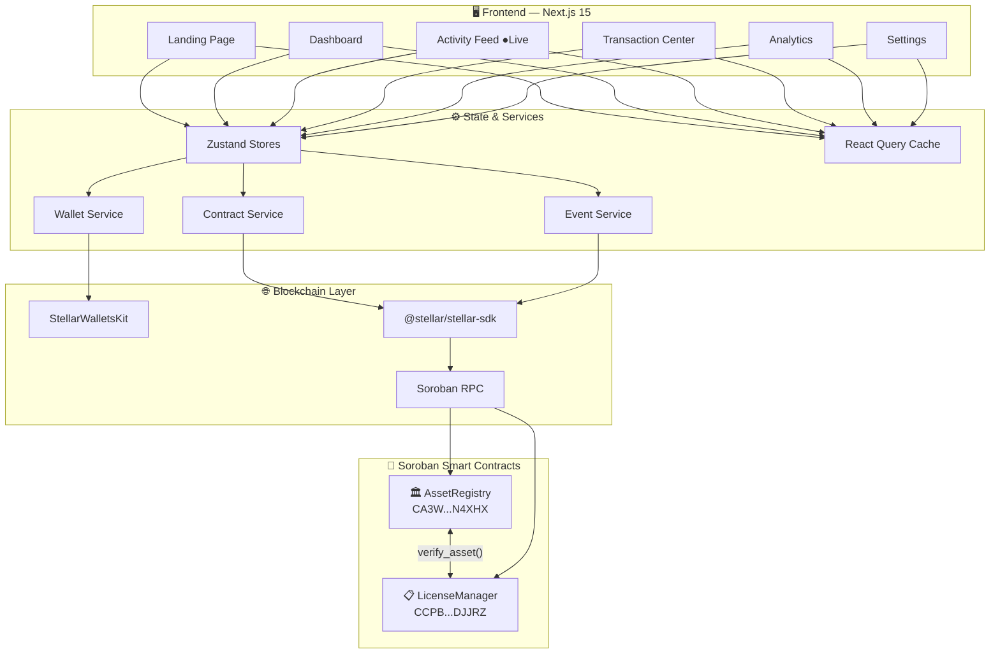
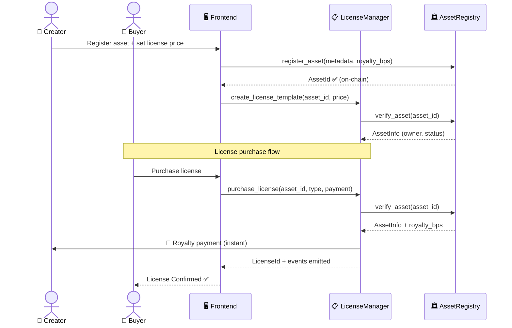

<div align="center">

<br/>

<picture>
  <source media="(prefers-color-scheme: dark)" srcset="https://readme-typing-svg.demolab.com?font=Fira+Code&weight=700&size=28&duration=3000&pause=1000&color=3B82F6&center=true&vCenter=true&width=600&lines=LUMINA;Digital+Asset+Licensing;Powered+by+Stellar+%2B+Soroban">
  
</picture>

<br/>

```
                             ██╗     ██╗   ██╗███╗   ███╗██╗███╗   ██╗ █████╗
                              ██║     ██║   ██║████╗ ████║██║████╗  ██║██╔══██╗
                              ██║     ██║   ██║██╔████╔██║██║██╔██╗ ██║███████║
                              ██║     ██║   ██║██║╚██╔╝██║██║██║╚██╗██║██╔══██║
                              ███████╗╚██████╔╝██║ ╚═╝ ██║██║██║ ╚████║██║  ██║
                              ╚══════╝ ╚═════╝ ╚═╝     ╚═╝╚═╝╚═╝  ╚═══╝╚═╝  ╚═╝
```

### **The On-Chain Ownership Layer for the Creative Economy**

*Register once. License anywhere. Get paid instantly — no middlemen, no delays, no trust required.*

<br/>

[](https://soroban.stellar.org)
[](https://nextjs.org)
[](https://typescriptlang.org)
[](https://rustlang.org)
[](./LICENSE)
[](https://github.com/thesayancodes/digital_asset_licensing_platform/actions)

<br/>

[**🚀 Live Demo**](#-demo) &nbsp;·&nbsp; [**📜 Smart Contracts**](#-contract-addresses) &nbsp;·&nbsp; [**⚡ Quick Start**](#-local-development) &nbsp;·&nbsp; [**🏗️ Architecture**](#-architecture)

<br/>

---

</div>

## 🌍 The Problem Worth Solving

> **Creators lose $2.3 billion annually** to unlicensed use of digital assets. Licensing today is a broken system:

| ❌ Old World | ✅ Lumina |
|---|---|
| Paper trails & PDF certificates | Immutable ledger entry, verifiable forever |
| Lawyers to enforce license terms | Smart contracts that self-execute |
| Royalties arrive weeks later via intermediaries | Paid in the same transaction, zero delay |
| Geographic & currency barriers | Stellar's global, low-cost ($0.000004) network |
| "Trust me" ownership claims | Cryptographic proof, no trust needed |

<br/>

---

## ✨ What Makes Lumina Different

<table>
<tr>
<td width="50%">

**🔐 Immutable Ownership Registry**
Every asset is fingerprinted and anchored to Stellar's ledger. Ownership is public, timestamped, and impossible to forge.

**📜 5 Programmable License Types**
Personal · Commercial · Editorial · Enterprise · Exclusive — each with smart-contract-enforced terms.

**💰 Zero-Delay Royalties**
Royalties are calculated and distributed in the same transaction as the license purchase. No reconciliation needed.

</td>
<td width="50%">

**🧠 Extensible AI Detection Layer**
An abstraction layer ready to plug into AI copyright-detection services — protecting creators automatically.

**📡 Real-Time Event Stream**
Live Soroban RPC polling broadcasts every purchase, registration, and royalty payment to all connected clients.

**🔄 Full Transaction Transparency**
Every transaction goes through a 5-stage lifecycle: Building → Simulating → Signing → Submitting → Confirmed.

</td>
</tr>
</table>

<br/>

---

## 🖥️ UI Showcase

> **Full-featured, production-grade frontend built with Next.js 15 + Tailwind CSS 4**

### 📊 Dashboard — Your Creative Empire at a Glance


> Real-time stats, revenue charts, license distribution, recent assets, and live activity — all in one view.

<br/>

### 📋 Asset Registration — On-Chain in Seconds


> Upload your asset, configure license terms, and watch the 5-stage transaction lifecycle unfold in real time.

<br/>

### 📡 Live Activity Feed — Every Event, Instantly


> Real-time Soroban event stream. Every license purchase, royalty payment, and asset registration — live.

<br/>

---

## 🏗️ Architecture



### 🔄 License Purchase — Inter-Contract Flow



<br/>

---

## 📜 Smart Contract Reference

### 🏛️ `AssetRegistry` — Ownership Layer

> *"If it's not on-chain, it doesn't exist."*

| Function | Description | Auth | Storage |
|---|---|---|---|
| `register_asset` | Anchor an asset to Stellar's ledger | Owner | Persistent |
| `transfer_asset` | Transfer ownership atomically | Current owner | Persistent |
| `verify_asset` | Return full asset info (called by LicenseManager) | Public | Read |
| `get_asset` | Fetch asset details by ID | Public | Read |
| `get_owner_assets` | List all assets for an address | Public | Read |
| `update_asset_status` | Activate / deactivate an asset | Owner or Admin | Persistent |
| `initialize` | Set admin + LicenseManager address | Admin | Instance |
| `upgrade` | Upgrade WASM (zero downtime) | Admin | — |

### 📋 `LicenseManager` — Licensing Layer

> *"License terms that enforce themselves."*

| Function | Description | Auth | Calls |
|---|---|---|---|
| `create_license_template` | Define a license offering for an asset | Asset owner | `verify_asset` |
| `purchase_license` | Buy a license + auto-distribute royalties | Buyer | `verify_asset` |
| `verify_license` | Check if a license is currently valid | Public | — |
| `revoke_license` | Revoke a license | Owner or Admin | — |
| `get_license` | Fetch license details | Public | — |
| `get_user_licenses` | All licenses for an address | Public | — |
| `get_asset_licenses` | All licenses for an asset | Public | — |
| `initialize` | Set admin, AssetRegistry, platform fee | Admin | — |
| `upgrade` | Upgrade WASM (zero downtime) | Admin | — |

> Both `create_license_template` and `purchase_license` cross-call `AssetRegistry::verify_asset()` to validate asset state before proceeding — keeping both contracts in sync without shared storage.

<br/>

---

## 🛠️ Tech Stack

<table>
<tr>
<td><b>Layer</b></td>
<td><b>Technology</b></td>
<td><b>Why</b></td>
</tr>
<tr>
<td>Smart Contracts</td>
<td>Rust + soroban-sdk 26.1.0</td>
<td>Type-safe, WASM-compiled, gas-efficient</td>
</tr>
<tr>
<td>Build Target</td>
<td>wasm32v1-none</td>
<td>Soroban-compatible WASM output</td>
</tr>
<tr>
<td>Frontend</td>
<td>Next.js 15 (App Router) + TypeScript 5</td>
<td>RSC, streaming, type safety end-to-end</td>
</tr>
<tr>
<td>Styling</td>
<td>Tailwind CSS 4</td>
<td>Zero-runtime, JIT, design token system</td>
</tr>
<tr>
<td>State</td>
<td>Zustand 5 + React Query 5</td>
<td>Minimal boilerplate, optimistic updates</td>
</tr>
<tr>
<td>Stellar</td>
<td>@stellar/stellar-sdk 16</td>
<td>Official SDK, full Soroban RPC support</td>
</tr>
<tr>
<td>Wallets</td>
<td>@creit-tech/stellar-wallets-kit</td>
<td>Freighter, xBull, Albedo in one adapter</td>
</tr>
<tr>
<td>Charts</td>
<td>Recharts</td>
<td>Composable, responsive, lightweight</td>
</tr>
<tr>
<td>Testing</td>
<td>Vitest + RTL · cargo test</td>
<td>Full coverage: unit + integration</td>
</tr>
<tr>
<td>CI/CD</td>
<td>GitHub Actions</td>
<td>Lint → test → audit → deploy pipeline</td>
</tr>
</table>

<br/>

---

## ⚡ Local Development

### Prerequisites

```bash
# 1. Rust 1.84+
curl --proto '=https' --tlsv1.2 -sSf https://sh.rustup.rs | sh

# 2. Soroban WASM target
rustup target add wasm32v1-none

# 3. Stellar CLI
cargo install --locked stellar-cli

# 4. Node.js 22+ → https://nodejs.org
# 5. Docker → https://docker.com  (for local sandbox)
```

### ⚡ One-shot setup

```bash
# Clone
git clone https://github.com/thesayancodes/digital_asset_licensing_platform lumina
cd lumina

# Build & test contracts
cd contracts && stellar contract build && cargo test

# Frontend
cd ../frontend && cp ../.env.example .env.local && npm install && npm run dev
```

### 🐳 Full Local Sandbox (Docker)

```bash
chmod +x scripts/deploy-local.sh && ./scripts/deploy-local.sh
```

This will:
1. Spin up a local Stellar node via Docker
2. Build and deploy both contracts with cross-references
3. Write contract IDs directly to `frontend/.env.local`
4. Your app is ready at `http://localhost:3000`

<br/>

---

## 🔐 Environment Variables

```bash
# Network
NEXT_PUBLIC_STELLAR_NETWORK=testnet
NEXT_PUBLIC_SOROBAN_RPC_URL=https://soroban-testnet.stellar.org
NEXT_PUBLIC_NETWORK_PASSPHRASE="Test SDF Network ; September 2015"

# Contracts
NEXT_PUBLIC_ASSET_REGISTRY_CONTRACT_ID=CA3WHFHXWSSPPVP32ZJSH5PS5IJ6AFU4IB45JC4BOMZMFZNPXPSN4XHX
NEXT_PUBLIC_LICENSE_MANAGER_CONTRACT_ID=CCPBUSTO4XATWWXNT3VXFZSWQQRIKTFTENZB4TCSH7ZTKWXDI64DJJRZ

# Explorer
NEXT_PUBLIC_EXPLORER_URL=https://stellar.expert/explorer/testnet

# Optional tunables
NEXT_PUBLIC_PLATFORM_FEE_BPS=250           # 2.5% platform fee
NEXT_PUBLIC_EVENT_POLL_INTERVAL_MS=5000    # 5s event polling

# Server-side only (NEVER expose to client)
STELLAR_DEPLOYER_SECRET=S...
```

<br/>

---

## 🧪 Testing

### Smart Contract Tests

```bash
cd contracts && cargo test
```

Tests cover: asset registration & retrieval, ownership transfer & authorization, inter-contract calls (LicenseManager ↔ AssetRegistry), license creation/purchase/revocation, event emission, unauthorized access rejection, and contract upgrade paths.

### Frontend Tests

```bash
cd frontend && npm run test
```

Tests cover: wallet store state (connect/disconnect/errors), asset registration form validation, transaction lifecycle tracking, and status display mapping.

<br/>

---

## 🚀 Deployment

### Testnet Deploy

```bash
chmod +x scripts/deploy-testnet.sh && ./scripts/deploy-testnet.sh
```

### Contract Upgrade (zero downtime)

```bash
chmod +x scripts/upgrade-contract.sh
./scripts/upgrade-contract.sh asset-registry testnet
./scripts/upgrade-contract.sh license-manager testnet
```

### CI/CD Pipeline

```
PR opened
  └── Rust fmt + Clippy
  └── cargo build --target wasm32v1-none
  └── cargo test
  └── cargo audit
  └── npm run lint + tsc --noEmit
  └── npm test
  └── npm run build
  └── npm audit

Merge to main
  └── Automatic frontend build
  └── Manual trigger → testnet contract deployment
```

<br/>

---

## 🔐 Security

See [SECURITY.md](./SECURITY.md) for the full security policy.

Key practices: `require_auth()` on every privileged operation · Private keys never touched in the frontend · All transactions simulated before submission · Contract upgrades require admin multisig · Input validation at both contract and frontend layers · Server-side secrets never exposed to the client.

<br/>

---

## 📍 Deployed Contracts

### Stellar Testnet

| Contract | Address | Explorer |
|---|---|---|
| **AssetRegistry** | `CA3WHFHXWSSPPVP32ZJSH5PS5IJ6AFU4IB45JC4BOMZMFZNPXPSN4XHX` | [View ↗](https://stellar.expert/explorer/testnet/contract/CA3WHFHXWSSPPVP32ZJSH5PS5IJ6AFU4IB45JC4BOMZMFZNPXPSN4XHX) |
| **LicenseManager** | `CCPBUSTO4XATWWXNT3VXFZSWQQRIKTFTENZB4TCSH7ZTKWXDI64DJJRZ` | [View ↗](https://stellar.expert/explorer/testnet/contract/CCPBUSTO4XATWWXNT3VXFZSWQQRIKTFTENZB4TCSH7ZTKWXDI64DJJRZ) |

**Deployed:** `2026-06-29T07:32:28Z` · **Network:** Stellar Testnet · **SDK:** soroban-sdk 26.1.0

<br/>

---

## 📁 Project Structure

```
lumina/
├── 📜 contracts/
│   ├── asset-registry/          # Ownership layer
│   │   └── src/
│   │       ├── lib.rs           # Contract entry points + dispatch
│   │       ├── types.rs         # Asset, AssetStatus, AssetInfo
│   │       ├── storage.rs       # Ledger read/write helpers
│   │       ├── errors.rs        # Custom ContractError enum
│   │       ├── events.rs        # AssetRegistered, AssetTransferred…
│   │       ├── access.rs        # require_auth, admin guards
│   │       └── test.rs          # Full unit + integration tests
│   └── license-manager/         # Licensing + royalty layer
│       └── src/
│           ├── lib.rs
│           ├── royalties.rs     # Basis-point royalty math
│           ├── types.rs
│           ├── storage.rs
│           ├── errors.rs
│           ├── events.rs        # LicensePurchased, RoyaltyPaid…
│           ├── access.rs
│           └── test.rs
│
├── 🖥️ frontend/
│   └── src/
│       ├── app/                 # Next.js App Router pages
│       │   ├── page.tsx         # Landing
│       │   ├── dashboard/       # Main dashboard
│       │   ├── assets/          # Asset management
│       │   ├── activity/        # Live event feed
│       │   ├── analytics/       # Revenue + charts
│       │   └── settings/        # Wallet + network config
│       ├── components/          # Shared UI components
│       ├── features/            # Wallet, assets, licenses, events
│       ├── lib/                 # Stellar client, utils, constants
│       └── providers/           # React context providers
│
├── 🔧 scripts/
│   ├── deploy-local.sh          # Docker sandbox deployment
│   ├── deploy-testnet.sh        # Testnet deployment
│   ├── upgrade-contract.sh      # Zero-downtime WASM upgrade
│   └── store-metadata.sh        # Update README contract addresses
│
├── ⚙️ .github/workflows/
│   ├── ci.yml                   # PR checks
│   └── deploy.yml               # Deploy pipeline
│
├── .env.example                 # Environment template
└── SECURITY.md
```

<br/>

---

## 🎥 Demo

https://github.com/user-attachments/assets/73f074c3-e540-4947-ba29-bb2bc1b28d0a


In the meantime, clone and run locally — full testnet contracts are live.

<br/>

---

<div align="center">

### Built for creators. Powered by Stellar.

```
Register → License → Earn → Repeat
```

[](https://stellar.org)
[](https://soroban.stellar.org)
[](https://developers.stellar.org)

<br/>

*If Lumina helped you, drop a ⭐ — it means everything to an indie creator.*

</div>
