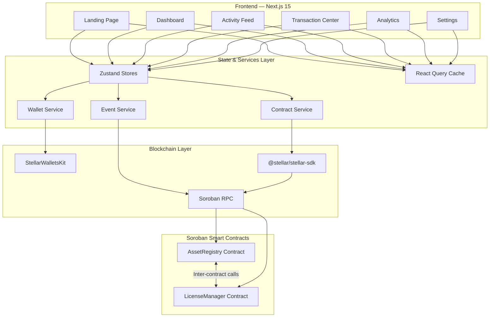
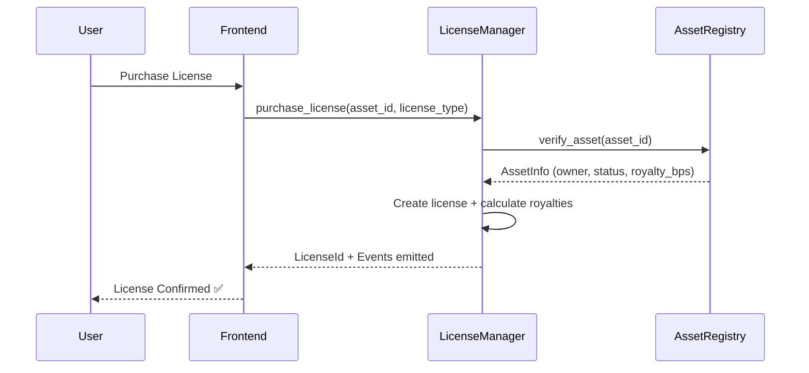

<div align="center">

<br/>

```
██╗     ██╗   ██╗███╗   ███╗██╗███╗   ██╗ █████╗
██║     ██║   ██║████╗ ████║██║████╗  ██║██╔══██╗
██║     ██║   ██║██╔████╔██║██║██╔██╗ ██║███████║
██║     ██║   ██║██║╚██╔╝██║██║██║╚██╗██║██╔══██║
███████╗╚██████╔╝██║ ╚═╝ ██║██║██║ ╚████║██║  ██║
╚══════╝ ╚═════╝ ╚═╝     ╚═╝╚═╝╚═╝  ╚═══╝╚═╝  ╚═╝
```

### **AI-Powered Digital Asset Licensing on Stellar**

*Register assets. Prove ownership on-chain. License in seconds. Get paid instantly.*

<br/>

[](https://soroban.stellar.org)
[](https://nextjs.org)
[](https://typescriptlang.org)
[](https://rustlang.org)
[](./LICENSE)

<br/>

[**Live Demo**](#-demo) · [**Smart Contracts**](#-contract-addresses) · [**Quick Start**](#-local-development) · [**Architecture**](#-architecture)

<br/>

---

</div>

## The Problem

Creators lose **billions** every year to unlicensed use of their digital assets. Licensing today is opaque, slow, and plagued with middlemen. There's no reliable way to prove ownership, enforce terms automatically, or receive royalties the moment a license is sold.

**Lumina puts licensing logic on-chain** — using Soroban smart contracts on Stellar to make asset ownership immutable, license enforcement automatic, and royalty payments instant.

<br/>

## Why Lumina?

| Challenge | Old Way | Lumina |
|-----------|---------|--------|
| Proving ownership | Certificates, paper trails | Immutable on-chain registry |
| Enforcing license terms | Lawyers, manual tracking | Smart contracts execute automatically |
| Receiving royalties | Weeks via intermediaries | Instant on license purchase |
| Global reach | Expensive & slow | Stellar's fast, low-cost network |

<br/>

## Features

**🔐 Blockchain Ownership** — Every asset registered on Stellar's public ledger. Immutable, timestamped, verifiable by anyone.

**📜 5 License Types** — Personal, Commercial, Editorial, Enterprise, and Exclusive licenses with programmable terms.

**💰 Automatic Royalties** — Royalties flow directly to creators the instant a license is purchased. No middlemen, no delays.

**🧠 AI Detection Layer** — Extensible copyright detection abstraction ready to plug into real-world AI services.

**📊 Analytics Dashboard** — Revenue charts, license distribution maps, and top asset performance at a glance.

**📡 Real-time Activity Feed** — Live contract events streamed via Soroban RPC event polling.

**🔄 Full Transaction Lifecycle** — Track every transaction: Building → Simulating → Signing → Submitting → Confirmed.

**👛 Multi-Wallet Support** — Freighter, xBull, and Albedo via StellarWalletsKit.

**🔧 Upgradeable Contracts** — WASM upgrade support so contracts evolve without losing data.

<br/>

## Architecture



### License Purchase Flow



<br/>

## Smart Contracts

### AssetRegistry

Handles all asset ownership — registration, transfer, and verification.

| Function | Description | Auth |
|----------|-------------|------|
| `register_asset` | Register a new digital asset | Owner |
| `transfer_asset` | Transfer asset to a new owner | Current owner |
| `verify_asset` | Return asset info (called by LicenseManager) | Public |
| `get_asset` | Fetch full asset details | Public |
| `get_owner_assets` | List all assets for an address | Public |
| `update_asset_status` | Activate or deactivate an asset | Owner or Admin |
| `upgrade` | Upgrade contract WASM | Admin |

### LicenseManager

Handles license lifecycle and royalty distribution, with cross-contract calls to AssetRegistry.

| Function | Description | Auth |
|----------|-------------|------|
| `create_license_template` | Create a license offering for an asset | Asset owner |
| `purchase_license` | Purchase a license with automatic royalty payment | Buyer |
| `verify_license` | Check if a license is currently valid | Public |
| `revoke_license` | Revoke an existing license | Owner or Admin |
| `get_license` / `get_user_licenses` / `get_asset_licenses` | Query licenses | Public |
| `upgrade` | Upgrade contract WASM | Admin |

> Both `create_license_template` and `purchase_license` call `AssetRegistry::verify_asset()` internally to validate asset existence and ownership before proceeding.

<br/>

## Tech Stack

| Layer | Technology |
|-------|-----------|
| Smart Contracts | Rust + soroban-sdk 26.1.0 |
| Build Target | wasm32v1-none |
| Frontend | Next.js 15 (App Router) + TypeScript 5.x |
| Styling | Tailwind CSS 4 |
| State Management | Zustand 5 |
| Data Fetching | @tanstack/react-query 5 |
| Stellar SDK | @stellar/stellar-sdk 16 |
| Wallet Kit | @creit-tech/stellar-wallets-kit |
| Charts | Recharts |
| Icons | Lucide React |
| Testing | Vitest + RTL · cargo test |
| CI/CD | GitHub Actions |

<br/>

## Local Development

### Prerequisites

```bash
# Rust 1.84+
curl --proto '=https' --tlsv1.2 -sSf https://sh.rustup.rs | sh

# WASM build target
rustup target add wasm32v1-none

# Stellar CLI
cargo install --locked stellar-cli

# Node.js 22+ — https://nodejs.org
# Docker (for local sandbox) — https://docker.com
```

### Setup

```bash
# 1. Clone
git clone https://github.com/thesayancodes/digital_asset_licensing_platform lumina
cd lumina

# 2. Build & test contracts
cd contracts
stellar contract build
cargo test

# 3. Set up frontend
cd ../frontend
cp ../.env.example .env.local
npm install
npm run dev
```

### Local Sandbox (Docker)

```bash
chmod +x scripts/deploy-local.sh
./scripts/deploy-local.sh
```

This will start a local Stellar node via Docker, build and deploy both contracts, initialize them with cross-references, and write contract addresses to `frontend/.env.local`.

<br/>

## Environment Variables

| Variable | Description | Required |
|----------|-------------|----------|
| `NEXT_PUBLIC_STELLAR_NETWORK` | `testnet` or `mainnet` | ✅ |
| `NEXT_PUBLIC_SOROBAN_RPC_URL` | Soroban RPC endpoint | ✅ |
| `NEXT_PUBLIC_NETWORK_PASSPHRASE` | Network passphrase | ✅ |
| `NEXT_PUBLIC_ASSET_REGISTRY_CONTRACT_ID` | Deployed AssetRegistry contract ID | ✅ |
| `NEXT_PUBLIC_LICENSE_MANAGER_CONTRACT_ID` | Deployed LicenseManager contract ID | ✅ |
| `NEXT_PUBLIC_EXPLORER_URL` | Stellar explorer base URL | ✅ |
| `NEXT_PUBLIC_PLATFORM_FEE_BPS` | Platform fee in basis points | ⬜ default: 250 |
| `NEXT_PUBLIC_EVENT_POLL_INTERVAL_MS` | Event polling interval | ⬜ default: 5000 |
| `STELLAR_DEPLOYER_SECRET` | Deployer secret key (server-side only) | Deploy only |

<br/>

## Testing

### Smart Contracts

```bash
cd contracts
cargo test
```

Covers asset registration and retrieval, ownership transfer and authorization, inter-contract calls between LicenseManager and AssetRegistry, license creation/purchase/revocation, event emission, and rejection of unauthorized access.

### Frontend

```bash
cd frontend
npm run test
```

Covers wallet store state (connect/disconnect/errors), asset registration form validation, transaction lifecycle tracking, and status display mapping.

<br/>

## Deployment

### Testnet

```bash
chmod +x scripts/deploy-testnet.sh
./scripts/deploy-testnet.sh
```

### Contract Upgrade

```bash
chmod +x scripts/upgrade-contract.sh
./scripts/upgrade-contract.sh asset-registry testnet
```

### CI/CD

Pull request checks run Rust formatting, Clippy lints, contract build and tests, frontend lint, type check, tests, build, and security audits (`npm audit` + `cargo audit`). The deploy workflow handles manual testnet deployment and automatic frontend builds on merge to `main`.

<br/>

## Contract Addresses

### Testnet

| Contract | Address |
|----------|---------|
| AssetRegistry | [`CA3WHFHXWSSPPVP32ZJSH5PS5IJ6AFU4IB45JC4BOMZMFZNPXPSN4XHX`](https://stellar.expert/explorer/testnet/contract/CA3WHFHXWSSPPVP32ZJSH5PS5IJ6AFU4IB45JC4BOMZMFZNPXPSN4XHX) |
| LicenseManager | [`CCPBUSTO4XATWWXNT3VXFZSWQQRIKTFTENZB4TCSH7ZTKWXDI64DJJRZ`](https://stellar.expert/explorer/testnet/contract/CCPBUSTO4XATWWXNT3VXFZSWQQRIKTFTENZB4TCSH7ZTKWXDI64DJJRZ) |

Deployed: `2026-06-29` · Network: Stellar Testnet

<br/>

## Project Structure

```
lumina/
├── contracts/
│   ├── asset-registry/         # Asset registration & ownership
│   │   └── src/
│   │       ├── lib.rs          # Contract entry points
│   │       ├── types.rs        # Data structures
│   │       ├── storage.rs      # Ledger storage helpers
│   │       ├── errors.rs       # Custom error types
│   │       ├── events.rs       # Event emission
│   │       ├── access.rs       # Auth guards
│   │       └── test.rs         # Unit tests
│   └── license-manager/        # Licensing & royalties
│       └── src/
│           ├── lib.rs
│           ├── royalties.rs    # Royalty calculation logic
│           └── ...
├── frontend/
│   └── src/
│       ├── app/                # Pages: landing, dashboard, activity…
│       ├── components/         # Shared UI components
│       ├── features/           # Wallet, assets, licenses, events…
│       ├── lib/                # Stellar client, utils, constants
│       └── providers/          # React context providers
├── scripts/                    # Deploy & upgrade scripts
├── .github/workflows/          # CI/CD pipelines
├── SECURITY.md
└── .env.example
```

<br/>

## Security

See [SECURITY.md](./SECURITY.md) for the full security documentation.

Key practices: `require_auth()` on every privileged operation, no private keys ever handled in the frontend, all transactions simulated before submission, contract upgrades require admin authorization, and input validation at both contract and frontend levels.

<br/>

## Demo

> Demo recording coming after deployment. Screenshots will be added for Landing, Dashboard, Activity Feed, Transaction Center, Analytics, and Settings pages.

<br/>

---

<div align="center">

Built with ❤️ on **[Stellar](https://stellar.org)** · Powered by **[Soroban](https://soroban.stellar.org)** · Docs at **[developers.stellar.org](https://developers.stellar.org)**

<br/>

*If Lumina helped you, consider giving it a ⭐*

</div>

</div>
]]>
